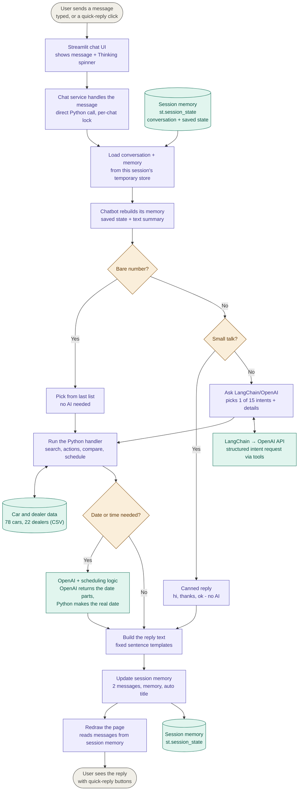

# Car Dealer Chatbot — Architecture

A chatbot that helps people find a car, see who sells it, and schedule a call with the dealer.

It is **one Streamlit web app** (one Python program). **LangChain** orchestrates **OpenAI** to work out what the user wants, the chatbot's own code finds the answer and writes the reply, and the conversation is kept temporarily in the **Streamlit session** — not in a database.



**Colors:** grey = user · purple = application code · orange = decision · green = external service / data

---

## Main parts

| Part | What it does |
|---|---|
| **User (web browser)** | Opens the website and chats. No login: each browser session gets its own temporary, isolated chat memory. |
| **Streamlit web app** | The website. Shows the chat window and the chat history sidebar. |
| **Chat service** | Loads the right conversation, hands the message to the chatbot, and saves the result back into session memory. |
| **Chatbot** | The brain. Decides what to do (search, show a dealer, schedule a call…) and writes the reply. |
| **LangChain + OpenAI API** | LangChain orchestrates OpenAI to read the message and say what the user wants (for example "search for BMWs under €50,000") via tool-calling. It does **not** write the reply. |
| **Car and dealer data** | 78 cars and 22 dealers, stored in two CSV files and loaded when the app starts. |
| **Session memory** | An in-memory store (`st.session_state`) holding this browser session's conversations, their messages, and the chatbot's memory of each chat. Nothing is written to disk or a database. |

---

## How one message flows

The diagram at the top shows every step. In short:

1. The user sends a message. The chat window shows it with a "Thinking..." spinner.
2. The chat service loads the conversation and its memory from this session's temporary store.
3. If the message is a bare number or small talk, the chatbot answers right away, with no AI.
4. Otherwise LangChain/OpenAI works out what the user wants (one of 15 intents, plus details) using tool-calling.
5. The chatbot runs the matching action (search, dealer details, compare, schedule) using the car and dealer data.
6. The reply is built from fixed sentence templates and written back into the session's temporary store, together with the message, the memory and the chat title.
7. The page redraws and the user sees the reply with quick-reply buttons.

A **bare number** is a message that is only a number, like `2`. When the bot has just shown a numbered list, `2` means "option 2", so no AI is needed.

---

## Memory: what is stored vs. what the AI sees

| | Stored chat | Chatbot memory |
|---|---|---|
| **What** | Every message, in full | Last 20 messages, facts the user shared (name, budget, city…), cars shown, car being discussed |
| **Used for** | Showing the chat on screen | Giving OpenAI the context of the conversation |
| **Does the AI see it?** | No | Yes |

Both live in this session's temporary memory. Older messages stay visible on screen, but the AI only sees the recent ones. None of it is persisted — it's gone once the session ends.

---

## Session memory

```text
Conversation store (st.session_state, one per browser session)
   ↓ has many
Conversations  (title, chatbot memory, dates)
   ↓ has many
Messages       (who sent it: user or assistant, text, time)
```

Deleting a conversation also deletes its messages. The whole store disappears when the session ends or the app restarts.

---

## Main features

**Car search:** user describes a car → OpenAI picks out make, budget, body type, city → chatbot searches the car list (typos are OK) → shows up to 5 matches as a numbered list.

**Dealer details:** user picks a car → chatbot finds its dealer → shows name, city, phone and email.

**Schedule a call:** user asks for a call → chatbot asks for a time → OpenAI reads "Friday at 3pm" → Python works out the real date → confirmation shown.
The booking is only saved in the conversation. Nothing is sent to the dealer.

---

## Chat history

| Action | What happens |
|---|---|
| **New chat** | Empty screen. The conversation is only created (in session memory) when the first message is sent. Earlier chats stay in the sidebar. |
| **Send a message** | Reply is added and the chat moves to the top of the sidebar. |
| **Open an old chat** | Its messages are read from this session's memory. |
| **Rename** | New name is saved and stops changing automatically. |
| **Delete** | The chat and all its messages are removed from session memory. |

Chat titles are created automatically (for example "Toyota Corolla Inquiry"), without using AI.

---

## Keeping sessions separate

```text
Browser session A → its own conversation store → only sees conversations of A
Browser session B → its own conversation store → only sees conversations of B
```

Each browser session gets its own `st.session_state`, and therefore its own conversation store — sessions never share memory. If Browser B opens Browser A's chat link, A's conversation doesn't exist in B's store, so nothing is found and a new chat starts.

---

## When something goes wrong

| Problem | What the user sees |
|---|---|
| OpenAI is unreachable | "Sorry, I'm having trouble reaching the language service right now." |
| Message not understood | A friendly "not sure what you mean" with examples. |
| Unexpected error while sending | "Something went wrong and your message wasn't sent." Nothing is saved. |
| App can't start (missing key) | An error message on the page. |

---

## Settings

| Setting | Used for |
|---|---|
| `OPENAI_API_KEY` | Connecting to OpenAI via LangChain's ChatOpenAI integration (required) |
| `LLM_MODEL` | Which OpenAI model to use (default `gpt-4o-mini`) |
